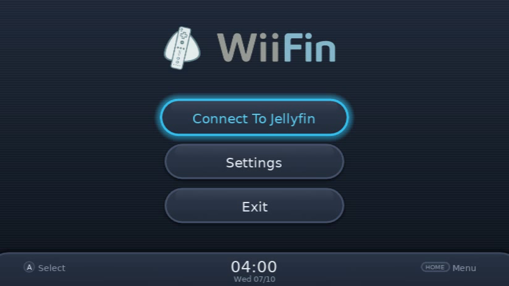
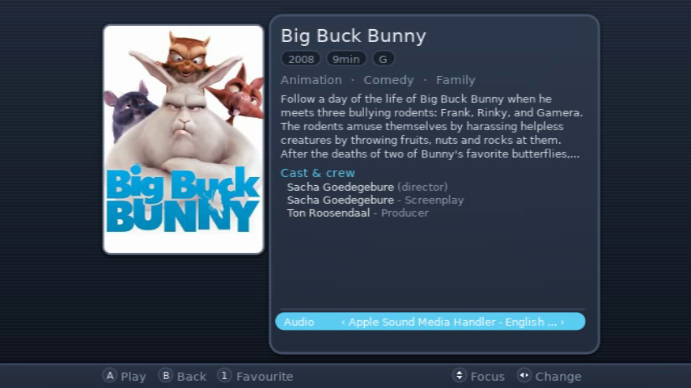
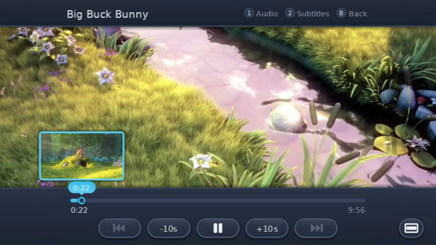
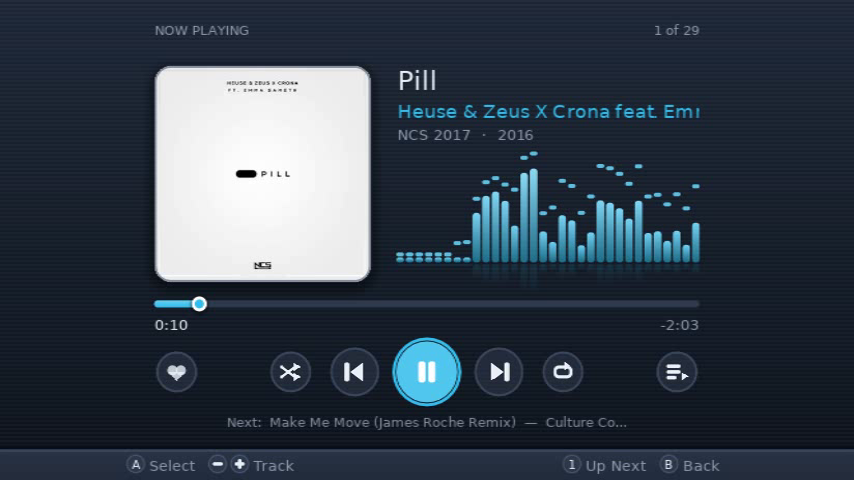

<p align="center">
  <br>
  <em>Jellyfin client for the Nintendo Wii</em>
</p>

<p align="center">
  <a href="README.md"></a>
  &nbsp;
  <a href="README/README.fr.md"></a>
  &nbsp;
  <a href="README/README.de.md"></a>
  &nbsp;
  <a href="README/README.es.md"></a>
  &nbsp;
  <a href="README/README.it.md"></a>
</p>

---

<p align="center">
<strong>WiiFin</strong> is an experimental homebrew client for <a href="https://jellyfin.org">Jellyfin</a>, built specifically for the Nintendo Wii.<br>
It browses and plays your films, series and music on the console itself, written in C++ with <a href="https://github.com/GRRLIB/GRRLIB">GRRLIB</a> and <a href="https://github.com/extremscorner/mplayer-ce">MPlayer CE</a>.
</p>

<table align="center">
  <tr>
    <td></td>
    <td></td>
  </tr>
  <tr>
    <td></td>
    <td></td>
  </tr>
</table>
<p align="center"><sub><em>Big Buck Bunny</em> © Blender Foundation, <a href="https://peach.blender.org">peach.blender.org</a> (CC BY 3.0) · <em>Pill</em> by Heuse & Zeus X Crona feat. Emma Sameth, <a href="https://ncs.io">NCS</a></sub></p>

---

## ⚠️ Project Status

> 🚧 **Experimental**: functional but still under active development. Expect rough edges on real hardware.

### ✅ What works

**Connecting**
- Sign in with a username and password, or with **Quick Connect** (approved from another device)
- **Server discovery** on the local network, or the address typed in (HTTP or **HTTPS**, self-signed certificates accepted)
- **Saved profiles**: several accounts and servers, only an access token kept (no password)

**Browsing**
- A home screen of **rows** (Continue Watching, Next Up, latest, top rated, favourites, genres) or a **grid** of libraries
- Film, series and music libraries as posters or lists (with the cover of the selected title); **A-Z** jumps with left / right
- **Sort & filter** a film or series library (button 2): by name, year, rating or date added; one genre; all, not watched, watched or favourites
- **Search** (button 1 on the home screen)
- **Detail page**: synopsis (all of it with − when the page cuts it short), rating, genres, cast, audio and subtitle tracks (those the server picks for you to start with: your subtitle mode and languages, the file's default and forced tracks), several **versions** of a film, **favourites** (button 1, also on a series), **watched / not watched** (+, also on a row of the episode list)
- **Special features**: trailers, featurettes, behind the scenes... of a film (button 2 on its page) or a series (after its seasons)
- **Series**: seasons (as posters, or a list with the season's cover) and episodes, **shuffle** (button 2), next / previous episode across seasons
- **Japanese, Chinese and Korean** titles and subtitles: Japanese built in, Chinese and Korean with the font of `apps/WiiFin/fonts/` (in the Homebrew Channel package)

**Video**
- Played by the integrated MPlayer CE engine: **direct play** of what the Wii decodes in real time (SD DivX/Xvid, MPEG-1/2, H.264 up to 480p, VP8; AVI, MKV, MP4, MPEG-TS/PS; seeks in the file itself), server-side transcoding for the rest, and back to transcoding when a file does not play smoothly (see [DIRECT_PLAY.md](DIRECT_PLAY.md))
- **Player**: seek bar with the server's trickplay thumbnails (Jellyfin 10.9+), volume, audio and subtitle tracks (text subtitles drawn by WiiFin, so the video can still play as it is), zoom (fit / fill)
- **Skip intro / recap / credits** buttons from the server's media segments (Jellyfin 10.10+ with a plugin such as Intro Skipper), and **Next episode** during the credits
- **Resume** where you left off; progress, pauses and the play method (direct or transcoded) reported to the server, each console a device of its own
- A slow connection lowers the quality by itself; a picture that gets stuck is retried another way, with a message that says what happens

**Music**
- Libraries in tabs as on Jellyfin: **Albums, Suggestions, Artists, Playlists, Songs** (a library of loose files opens on its songs)
- A **Now Playing** screen with the cover, a live spectrum of the sound, an Up Next queue, shuffle, repeat, favourites, and similar tracks once the queue runs out

**Remote control** from the Jellyfin dashboard or apps
- **Play on... Nintendo Wii** (films, episodes, music; Play next and Add to queue for music)
- Play / pause, stop, seek, next / previous, volume and mute (the dashboard's slider follows), audio and subtitle tracks
- **Messages** sent from the dashboard show over any screen

**And also**
- **Wii Remote** pointer, **Classic Controller**, **Wii U GamePad** (Virtual Console injects) and **GameCube controller**: everything works with the D-pad, no sensor bar needed (see [Controls](#-controls))
- **Interface sounds** and **background music**, both replaceable with your own files (see [Custom sounds](#-custom-sounds))
- On-screen keyboard; screen area calibration for TVs that crop the picture; the disc slot light can stay off
- Ships as a ready-to-use `.dol`, an installable `.wad` (Wii / vWii) and a Homebrew Channel package

### 🎮 Controls

The pointer is optional: every screen works with the D-pad.

| Wii Remote | Classic Controller / Wii U GamePad | GameCube controller | Action |
|---|---|---|---|
| A / B | A / B | A / B | Select / Back |
| D-pad | D-pad or left stick | D-pad or stick | Move (hold to repeat); left / right: A-Z in lists, −10 / +10 s in the player |
| − / + | − / + or L / R | L / R | Tabs, pages, previous / next episode or track; + : watched / not watched (a film, an episode); − : the whole synopsis (a page) |
| 1 | Y | Y | Search (home), favourite (a film, a series), audio track (player), Up Next (music) |
| 2 | X | X | Sort & filter (lists), special features (a film), shuffle (series, music), subtitles (player) |
| HOME | HOME | START | HOME menu |
| pointer | ZL / ZR | Z | Video zoom (fit / fill); in the menus, what + does on its own: watched / not watched, the browse page, the keyboard's Enter |

On-screen hints show the buttons of the controller used last (GameCube: A green, B red, L / R, Z, START).

### ⚙️ Settings

| Setting | |
|---|---|
| SSL Verification | Check the server's HTTPS certificate (off for self-signed ones) |
| Background Music / Interface Sounds | The menus' music and sounds |
| Video Quality | The transcoding bitrate, from Low (1.5 Mb/s) to Max (5 Mb/s, for a wired adapter); WiiFin also measures the connection and stays under it |
| Direct Play | Play the files the Wii can decode as they are, without the server converting them |
| Smooth Motion | Blend frames on picture changes, so 24 fps films move evenly on 60 Hz TVs |
| Theme / Home Screen / Library View | Light, Dark or Flix; rows or a grid; posters, a list, or a list with the cover |
| Disc Slot Light | The light pulsing with the sound during playback, or off |
| Screen Area | Shrink the interface when the TV crops its edges |
| Backgrounds | Soft gradients, or solid colours for TVs that show bands in them |
| Clock | 24-hour or 12-hour (AM/PM, the date as month/day); 12-hour by default on a US Wii |

### 🔊 Custom sounds

Put your own sounds in `SD:/apps/WiiFin/sounds/` (next to `wiifin.cfg`): a file there replaces the built-in sound of the same name, the others stay. They are read when WiiFin starts.

| File | Played when |
|---|---|
| `move` | the highlight moves (lists, rows, grids, settings) |
| `open` | a show, film, season or library opens |
| `back` | B goes back |
| `page` | a page or tab turns (− / +) |
| `play` | a video or a song starts |
| `start` | a button is pressed in the main menu, a setting changes |
| `select` | the pointer moves onto a main menu button |
| `press_key` / `backspace` | a key of the on-screen keyboard |
| `loading` | a loading screen lasts (played in a loop) |
| `menu_enter` / `menu_exit` | the HOME menu opens / closes |
| `bgm` | background music (MP3 only, up to 16 MB, played in a loop) |

Each sound is `name.mp3` or `name.wav` (PCM, 8 or 16-bit, mono or stereo, up to 48 kHz), at most 2 MB and 10 s (longer sounds are cut). A file WiiFin cannot read is ignored, and the log says why. Settings > Interface Sounds turns them all off; Background Music turns off the music.

### ⚠️ Known limitations

- Direct play only for what the Wii decodes in real time (SD resolutions, see [DIRECT_PLAY.md](DIRECT_PLAY.md)); the server converts the rest
- Stereo output only (multi-channel audio is mixed down)
- Picture subtitles (PGS, VobSub) are burned into the video by the server; text subtitles are drawn by WiiFin
- Chinese and Korean need the font in `SD:/apps/WiiFin/fonts/`: the Homebrew Channel package has it; with the WAD, copy `data/fonts/cjk/` there (any other `.ttf` / `.otf` there is used too, for what the other fonts lack)

---

## 🔧 Build Instructions

### Requirements

- [devkitPro](https://devkitpro.org) with `devkitPPC`, `libogc`, and `wii-dev` portlibs
- Graphics: `GRRLIB`, `libpngu`, `freetype`, `libjpeg`
- mbedTLS (bundled under `libs/`, cross-compiled by `setup.sh`)
- MPlayer CE as `libmplayer.a`, for playback: prebuilt in `libs/mplayer-ce-build`, rebuilt from source by `tools/mplayer/build.sh` (see [MPLAYER_CE_BUILD.md](MPLAYER_CE_BUILD.md)). Without it, WiiFin still compiles but cannot play.

### Building

On a fresh machine, `./setup.sh` installs devkitPro and the portlibs, builds GRRLIB and mbedTLS, then compiles WiiFin (Arch-based distros, or any host with `dkp-pacman`).

```bash
./build.sh          # WiiFin.dol
./build.sh wad      # WiiFin.wad, the installable channel (needs libWiiPy, installed by setup.sh)
```

`make wad` puts `WiiFin.dol` into `tools/wad/template.wad` (banner, NAND loader, ticket and TMD of title `WIFN`) and fakesigns it: see `tools/make_wad.py`.

### Running

On **real Wii hardware**: unzip `WiiFin-hbc.zip` at the root of the SD card (it holds `apps/WiiFin/`) to start WiiFin from the Homebrew Channel, or install `WiiFin.wad` with a WAD manager (works on vWii too). WiiFin keeps its settings, profiles and log (`wiifin.log`) in `SD:/apps/WiiFin/`.

On **Dolphin Emulator**:

```bash
dolphin-emu -e WiiFin.dol
```

To test against a local Jellyfin in Docker, with scripted button presses and frame captures, see [tools/test](tools/test/README.md).

---

## 📁 Project Structure

```
WiiFin/
├── source/
│   ├── core/        # App, settings, playback sessions, sounds and music, text drawing, log
│   ├── input/       # Wii Remote, Classic Controller and GameCube controller
│   ├── jellyfin/    # Jellyfin API client (HTTPS via mbedTLS), remote control (WebSocket)
│   ├── player/      # MPlayer CE integration, video output, player overlay, subtitles, thumbnails
│   └── ui/          # The screens: connection, profiles, home, libraries, details, music, settings
├── data/            # Fonts, sounds, pictures
├── libs/            # mbedTLS, the prebuilt MPlayer CE
├── tools/           # WAD packager, linker script, MPlayer CE build (mplayer/)
│   └── test/        # Test harness: Jellyfin in Docker, scripted runs in Dolphin
├── apps/WiiFin/     # Homebrew Channel metadata
├── DIRECT_PLAY.md   # What the Wii plays as it is
└── Makefile
```

---

## 🤝 Contributing

WiiFin is open to pull requests, bug reports, and suggestions.

* 📘 Read the [contribution guidelines](CONTRIBUTING.md)
* 🐛 Use the [bug report template](.github/ISSUE_TEMPLATE/bug_report.yml)
* 💡 Got a feature idea? Use the [feature request template](.github/ISSUE_TEMPLATE/feature_request.yml)

<a href="https://discord.gg/p9DXfEmUYu">
  
</a>

---

## 📜 License

This project is licensed under the **GPLv3**.
See the [LICENSE](LICENSE) file for more details.
